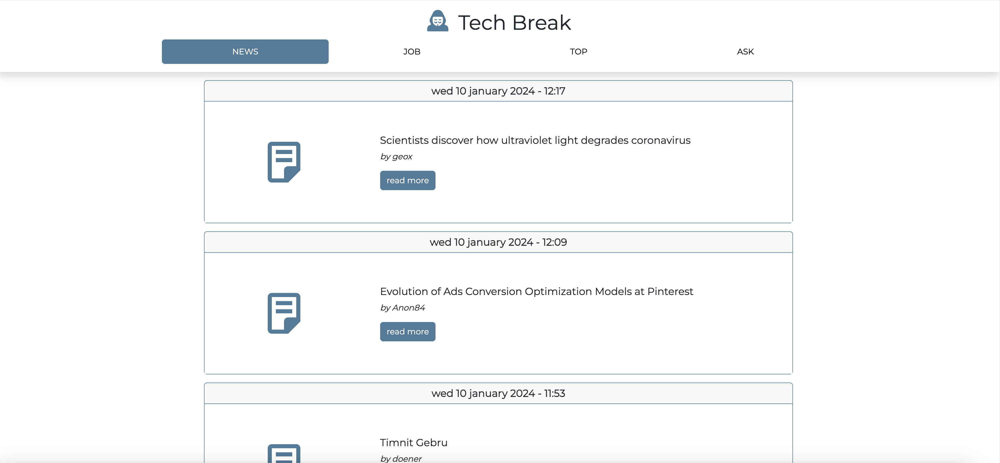
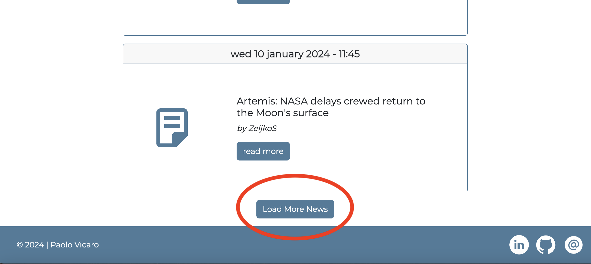
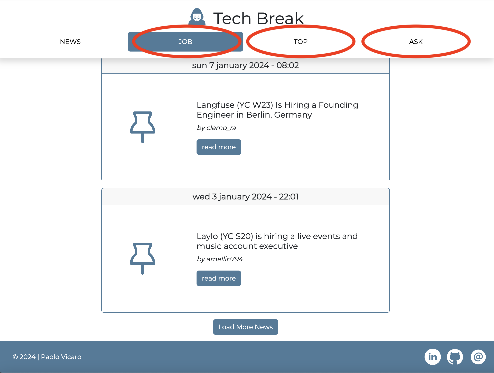

# TECH BREAK NEWS

## Descrizione
Tech Break è una webapp che notizie relative all'ambito tecnologico sfruttando le API di [Hacker News](https://github.com/HackerNews/API). Usa la libreria Axios per effettuare richieste HTTP per recuperare i dati delle notizie da vari endpoint API e quindi genera dinamicamente elementi HTML per visualizzare gli articoli della notizia sulla pagina. Il codice include funzioni per:
	•	Recuperare l'elenco di ID delle notizie da un endpoint API specificato
	•	Recuperare i dettagli di un articolo di notizie specifico utilizzando il suo ID
	•	Convertire una data Unix in una stringa di data formattata
	•	Visualizzare gli articoli di notizie sulla pagina
	•	Gestire le interazioni utente come fare clic su una scheda per visualizzare un set diverso di notizie o fare clic su un pulsante "Load More" per recuperare articoli di notizie aggiuntivi.
Include anche alcune semplici gestione degli errori e una funzione per ricaricare la pagina.

## Funzionalità
L'utilizzo dell'applicazione è semplice: al primo avvio vengono caricate le 10 notizie più recenti della categoria NEWS. Per caricarne altre, 10 per volta, basta cliccare sul pulsante "LoadMore".

Cliccando sui tab nella parte superiore della pagina si può navigare tra le diverse categorie di notizie.

## Installazione
1. Clona il repository: `git clone https://github.com/paolov85/technews.git`
2. Installa le dipendenze: `npm install`
3. Inizializza la build: `npm run build` oppure `npm run build:dev`

## Utilizzo
1. Avvia l'applicazione di test: `npm run dev`
2. Apri il browser e vai a `http://localhost:8080`

